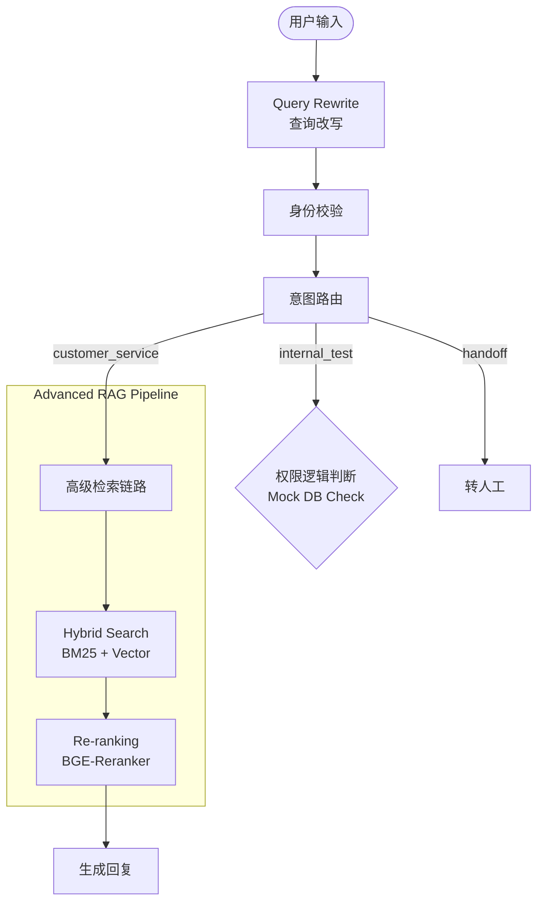

# 🛡️ RiskControl-Agent: 垂直领域风控 RAG 智能体

> **关键词**: LangGraph, Advanced RAG, Query Rewrite, Re-ranking, Local LLM, vLLM

[](https://www.python.org/downloads/release/python-3100/)
[](https://python.langchain.com/)

## 📖 项目背景
在电商风控场景下，客诉处理面临**SOP逻辑复杂**（如刷单封禁 vs 误伤解封）、**意图识别困难**（测试黑话 vs 正常咨询）、**数据敏感**三大痛点。

本项目基于 **Qwen2.5-7B** 本地模型，利用 **LangGraph** 构建了一个包含**意图路由、权限校验、高级检索、结构化兜底**的风控智能体。

## 🏗️ 核心架构 (已升级)

本项目摒弃了传统的线性 Chain 结构，采用 **LangGraph** 构建状态机（State Machine），并实现了 **Advanced RAG** 检索链路。



## ✨ 核心特性 (Key Features)

### 1. 多层级意图路由 (Hierarchical Routing)
*   通过 Prompt Engineering 精准识别“显性客诉”与“隐性测试需求”（如借号、跑流程）。
*   **安全防御**：在 Code 层实施 RBAC 权限校验，成功防御 Social Engineering 攻击（如黑产伪装内部员工）。

### 2. Advanced RAG 检索引擎 
针对风控文档中存在的逻辑冲突（如《解封SOP》与《刷单SOP》的规则对抗），重构了检索模块：
*   **Query Rewrite**: 将用户口语转化为风控专业术语，提升检索对齐度。
*   **Hybrid Search**: 结合 **BM25** (关键词匹配) 与 **BGE-M3** (语义向量) 进行多路召回，解决专有名词漏召回问题。
*   **Re-ranking (重排序)**: 引入 **BGE-Reranker** 对 Top-10 文档进行精排。
    *   *效果*：有效解决了“刷单账号请求解封”时的文档冲突问题，模型准确采纳拒绝条款。

### 3. 纯本地化高性能部署
*   使用 **vLLM** 部署 **Qwen2.5-7B-Instruct-AWQ** (Int4 量化)，在单卡 RTX 3090 上实现高吞吐推理。
*   数据完全不出域，满足风控合规要求。

## 📊 自动化评测 (Evaluation)

基于 **LLM-as-a-Judge** 范式构建了自动化评测流水线 (`3_evaluate_custom.py`)。不依赖第三方黑盒框架，手写实现了针对“忠实度”和“准确度”的量化评估。

**实测表现 (Evaluation Report):**

| Metric | Score (Avg) | 说明 |
| :--- | :--- | :--- |
| **Faithfulness** | **0.91** | 回答严格忠实于 SOP 文档，无幻觉。 |
| **Accuracy** | **0.87** | 准确处理了长尾问题和逻辑陷阱。 |

*(详细评测日志可见 `evaluation_report_custom.json`)*

## 🚀 快速开始

### 1. 环境准备
```bash
# 安装依赖 (需包含 rank_bm25, scikit-learn 等新组件)
pip install -r requirements.txt
```

### 2. 启动服务与构建
```bash
# A. 启动 vLLM
python -m vllm.entrypoints.openai.api_server --model <path> --served-model-name Qwen2.5-7B --port 8002

# B. 构建知识库 (自动语义切片)
python 1_build_rag.py
```

### 3. 运行智能体
```bash
python 2_agent_core.py
```

### 4. 运行评测
```bash
# 使用镜像源防止模型下载超时
HF_ENDPOINT=https://hf-mirror.com python 3_evaluate_custom.py
```

## 📂 项目结构

```text
RiskControl-Agent/
├── data/               # 核心资产：SOP文档/FAQ/MockDB
├── 1_build_rag.py      # ETL: 知识库切片与构建
├── 2_agent_core.py     # Core: 状态机与对话主程序
├── 3_evaluate_custom.py# Eval: 自动化评测流水线
├── rag_advanced.py     # Module: 高级RAG引擎 (Rewrite/Hybrid/Rerank)
├── evaluation_report_custom.json # 评测报告数据
└── README.md
```

## 🔮 待优化方向

*   **多轮对话记忆**：目前基于单轮意图识别，未来计划引入 Checkpointer 实现长周期的工单状态跟踪。
*   **前端可视化**：计划接入 Streamlit 实现更友好的交互界面。
*   **线上反馈闭环**：计划引入线上真实流量的 Human Feedback (RLHF) 来持续优化评测集。

---

*Created by YuanJiayu | Powered by LLM & LangGraph*
